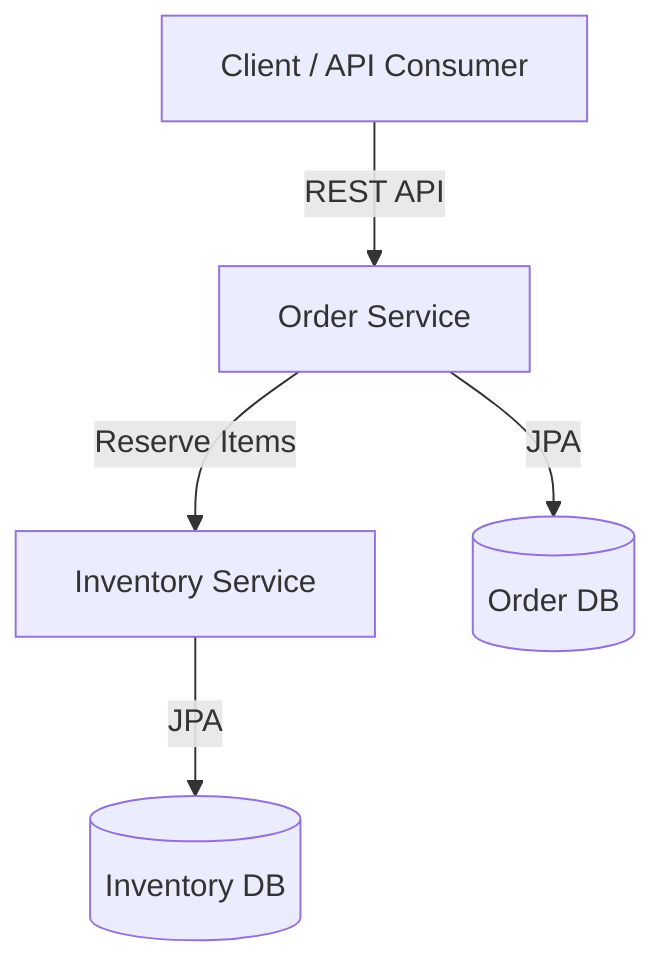

# Distributed Order Management System (DOMS)

A **microservices-based Distributed Order Management System** built using **Spring Boot, Java, PostgreSQL**, and REST APIs. The system demonstrates real-world backend engineering concepts such as service decomposition, data consistency, inventory reservation, and clean architecture.

---

## 🚀 Tech Stack

* **Java 17+**
* **Spring Boot 3.x**
* **Spring Data JPA (Hibernate)**
* **PostgreSQL**
* **RESTful APIs**
* **Maven**
* **Lombok**
* **SonarQube (Code Quality)**

---

## 🧩 Microservices

### 1️⃣ Order Service

Responsible for:

* Creating customer orders
* Managing order lifecycle (`CREATED`, `CONFIRMED`, `CANCELLED`)
* Communicating with Inventory Service to reserve stock

**Port:** `8080`

---

### 2️⃣ Inventory Service

Responsible for:

* Managing product inventory
* Reserving and releasing stock
* Preventing overselling

**Port:** `8081`

---

## 🏗️ High-Level Architecture



---

## 🔁 Order Flow

1. Client sends **Create Order** request
2. Order Service persists order with status `CREATED`
3. Order Service calls Inventory Service `/inventory/reserve`
4. Inventory Service validates and reserves stock
5. Order status updated to `CONFIRMED`

---

## 📦 Sample API Requests

### Create Order

```http
POST /orders
Content-Type: application/json
```

```json
{
  "customerId": "C123",
  "items": [
    { "productId": "P1", "quantity": 2, "price": 100 },
    { "productId": "P2", "quantity": 1, "price": 300 }
  ]
}
```

---

### Reserve Inventory

```http
POST /inventory/reserve
Content-Type: application/json
```

```json
{
  "productId": "P1",
  "quantity": 2
}
```

---

## 🗄️ Database Design

### Inventory Table

| Column             | Type         |
| ------------------ | ------------ |
| product_id         | VARCHAR (PK) |
| available_quantity | INT          |
| reserved_quantity  | INT          |

---

## ✅ Key Engineering Highlights

* Clear **service boundaries**
* Transactional inventory reservation
* Defensive error handling (`Product not found`, insufficient stock)
* Production-style logging
* SonarQube-compliant clean code practices

---

## 🧪 Testing

* APIs tested via **Postman**
* Database verified using PostgreSQL
* Logs monitored for transactional correctness

---

## 🔮 Future Enhancements

* API Gateway (Spring Cloud Gateway)
* Service Discovery (Eureka)
* Event-driven communication (Kafka)
* Distributed tracing (Zipkin)
* Docker & Kubernetes deployment

---

## 👨‍💻 Author

**Rikth Chakraborty**
Backend / Java Developer

> This project is designed to demonstrate real-world backend system design and microservices best practices.
